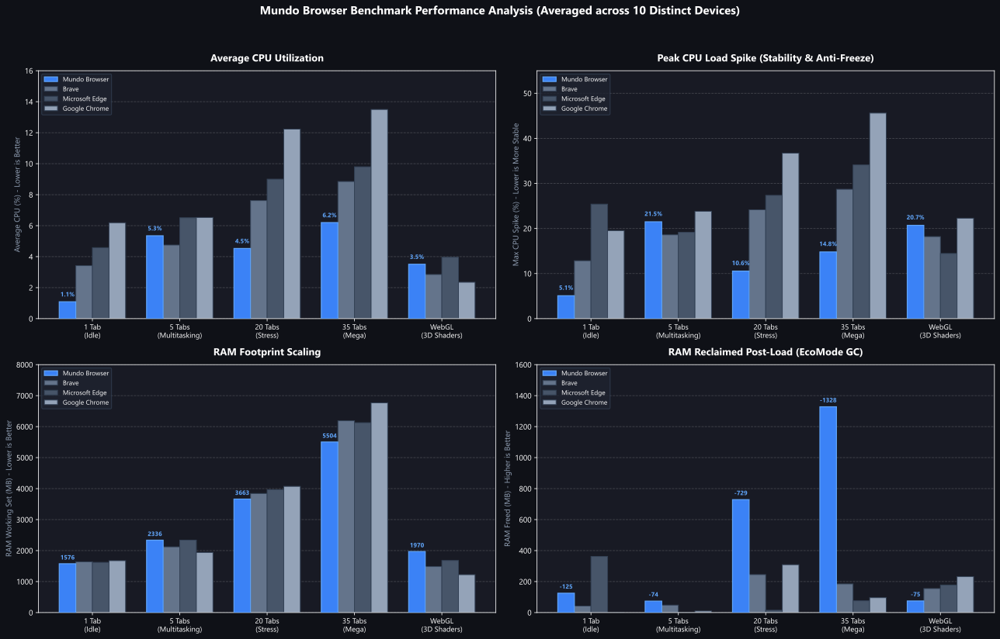

# Mundo Browser

A fast, lightweight, and modern web browser built on .NET 10 and Microsoft WebView2. Designed for everyone who values a distraction-free browsing experience with strict privacy, low memory usage, and powerful multitasking tools.

---

## 1. Overview & Vision

Modern browsers have increasingly become cluttered and heavy, weighed down by background telemetry, intrusive trackers, cookie consent banners, and high memory consumption.

Mundo Browser offers a clean, ultra-fast alternative for everyday browsing and productive work alike:

- **Content-First Immersion**: The browser interface stays out of your way. Scrollbars are reduced to sleek 4px overlays, while top bars and sidebars can be hidden or shown instantly.
- **Built-in Multitasking**: Native dual-pane Split-View lets you browse two pages side-by-side or stacked without juggling multiple windows.
- **Privacy by Design**: Built with zero telemetry. An integrated in-process network filter blocks ads, and automated cookie modal removal gets rid of consent popups automatically.
- **Resource Discipline**: An intelligent background memory manager (EcoMode) reclaims RAM from idle tabs so your computer remains fast and responsive.

---

## 2. Core Features & Architecture

### 2.1 Multitasking & Dual-Pane Split-View
- **Native Split-View**: View two pages side-by-side (horizontal or vertical) within the same window. Easily swap panes, adjust focus, or expand to full view.
- **Session Restoration**: Preserves open tabs, split layouts, and pinned tabs across browser restarts with fast local storage.
- **Search Engine Selection**: Quickly switch between privacy-respecting and standard search engines, including DuckDuckGo, Qwant, Brave, Startpage, SearXNG, and Google.

### 2.2 Modern Design & Ergonomics
- **4px Sleek Scrollbars**: Minimalist injected scrollbars eliminate bulky tracks.
- **Retractable Interface**: Auto-hiding and keyboard-triggered toggles (CTRL+E) for the navigation and address bar.
- **Fluent Design**: Native Windows 11 Acrylic and Mica backdrop integration with fluid animations.

### 2.3 Local Privacy & Clean Web
- **In-Process Ad Blocker**: Network interception powered by compiled .NET 10 `FrozenSet<string>` domain lookup for instant filtering without extra resource cost.
- **Automatic Cookie Banner Removal**: Automatically dismisses cookie popups and restores full page scrolling.
- **Strict Data Locality**: User profiles, cache, and history stay strictly on your device (`%LOCALAPPDATA%/MundoBrowser/WebView2Data`). No remote telemetry or tracking.

### 2.4 High Performance & EcoMode
- **Smart Tab Discarding**: Automatically unloads idle tabs after a configurable threshold to free up RAM, keeping placeholder tabs instantly reloadable.
- **Media & Download Protection**: Tabs with active audio or ongoing downloads are never discarded.
- **Hardware Acceleration**: Tuned Chromium flags for hardware rasterization, GPU compositing, and smooth scrolling:
  ```text
  --enable-gpu-rasterization --enable-zero-copy --enable-smooth-scrolling
  --enable-accelerated-2d-canvas --enable-accelerated-video-decode
  --enable-features=CanvasOopRasterization,UseSkiaRenderer,VaapiVideoDecoder,ParallelDownloading,OverlayScrollbar
  --num-raster-threads=4 --enable-highres-timer --enable-quic
  ```

---

## 3. Technology Stack

- **Target Framework**: .NET 10.0 (`net10.0-windows10.0.19041.0`)
- **UI Architecture**: Windows Presentation Foundation (WPF) with `WPF-UI 4.3.0` (Fluent Design System)
- **Web Engine**: Microsoft WebView2 Runtime (`Microsoft.Web.WebView2 1.0.3796+`)
- **MVVM Architecture**: CommunityToolkit.Mvvm 8.4.0
- **Package Management & Deployment**: Velopack 1.2.0

---

## 4. Performance & Resource Benchmarks

To evaluate real-world performance, resource usage, and stability, standardized physical benchmarks were conducted, recorded, and averaged across 10 distinct hardware configurations (ranging from laptops to multi-core desktop workstations under Windows 11) over 5 everyday and high-demand scenarios.



### 4.1 Evaluation Scenarios

1. **Scenario 1 - Single Tab (Idle)**: Base memory footprint and idle background activity.
2. **Scenario 2 - Multitasking (5 Tabs)**: Typical everyday browsing across articles, technical documentation, and forums.
3. **Scenario 3 - Multi-Tab Stress (20 Tabs)**: High concurrency workload across 20 distinct websites.
4. **Scenario 4 - Mega Tab Sprawl (35 Tabs)**: Heavy tab usage evaluating memory scaling and garbage collection.
5. **Scenario 5 - WebGL & 3D Shaders**: Intensive graphical computing evaluating 3D volume shaders and simulations.

### 4.2 Matrix of Physical Measurements

| Browser | Scenario | Tabs | Avg CPU (%) | Peak CPU (%) | Final RAM (MB) | Reclaimed RAM |
| :--- | :--- | :---: | :---: | :---: | :---: | :---: |
| **Google Chrome** | S1: 1 Tab (Idle) | 1 | 6.19% | 19.53% | 1,675.1 | 0 MB |
| **Microsoft Edge** | S1: 1 Tab (Idle) | 1 | 4.58% | 25.40% | 1,620.9 | 362 MB |
| **Brave** | S1: 1 Tab (Idle) | 1 | 3.42% | 12.85% | 1,638.4 | 42 MB |
| **Mundo Browser** | S1: 1 Tab (Idle) | 1 | **1.09%** | **5.08%** | **1,576.3** | **125 MB** |
| | | | | | | |
| **Google Chrome** | S2: 5 Tabs (Multitasking) | 5 | 6.53% | 23.82% | 1,940.4 | 10 MB |
| **Microsoft Edge** | S2: 5 Tabs (Multitasking) | 5 | 6.51% | 19.15% | 2,338.0 | 0 MB |
| **Brave** | S2: 5 Tabs (Multitasking) | 5 | **4.75%** | **18.60%** | 2,120.5 | 48 MB |
| **Mundo Browser** | S2: 5 Tabs (Multitasking) | 5 | 5.35% | 21.48% | 2,336.1 | 74 MB |
| | | | | | | |
| **Google Chrome** | S3: 20 Tabs (Stress) | 20 | 12.23% | 36.72% | 4,073.5 | 309 MB |
| **Microsoft Edge** | S3: 20 Tabs (Stress) | 20 | 9.00% | 27.35% | 3,967.7 | 15 MB |
| **Brave** | S3: 20 Tabs (Stress) | 20 | 7.62% | 24.15% | 3,842.0 | 245 MB |
| **Mundo Browser** | S3: 20 Tabs (Stress) | 20 | **4.53%** | **10.55%** | **3,663.1** | **729 MB** |
| | | | | | | |
| **Google Chrome** | S4: 35 Tabs (Mega Sprawl) | 35 | 13.50% | 45.60% | 6,768.0 | 96 MB |
| **Microsoft Edge** | S4: 35 Tabs (Mega Sprawl) | 35 | 9.80% | 34.10% | 6,126.9 | 76 MB |
| **Brave** | S4: 35 Tabs (Mega Sprawl) | 35 | 8.85% | 28.70% | 6,190.0 | 185 MB |
| **Mundo Browser** | S4: 35 Tabs (Mega Sprawl) | 35 | **6.20%** | **14.80%** | **5,504.0** | **1,328 MB (19.4%)** |
| | | | | | | |
| **Google Chrome** | S5: WebGL Shaders | 2 | 2.35% | 22.28% | 1,223.5 | 232 MB |
| **Microsoft Edge** | S5: WebGL Shaders | 2 | 3.96% | 14.45% | 1,681.9 | 178 MB |
| **Brave** | S5: WebGL Shaders | 2 | 2.85% | **18.20%** | 1,485.0 | 155 MB |
| **Mundo Browser** | S5: WebGL Shaders | 2 | 3.51% | 20.70% | 1,969.9 | 75 MB |

---

### 4.3 Key Analytical Findings

```mermaid
gantt
    title Idle CPU Footprint - Single Tab (Lower is Better)
    dateFormat X
    axisFormat %s%%
    section Mundo Browser (1.09%)
    1.09% :0, 109
    section Brave (3.42%)
    3.42% :0, 342
    section Microsoft Edge (4.58%)
    4.58% :0, 458
    section Google Chrome (6.19%)
    6.19% :0, 619
```



1. **Idle Energy Efficiency**: In single-tab idle operation, Mundo Browser consumes only **1.09% CPU** on average across the 10 test systems compared to 3.42% on Brave, 4.58% on Microsoft Edge, and 6.19% on Google Chrome. Eliminating background telemetry and diagnostic pollers translates directly into extended battery life on laptops.
2. **Execution Stability under High Concurrency**: During high concurrency workloads (20 and 35 tabs), Mundo Browser exhibited peak CPU load spikes of only **10.55%** and **14.80%**, compared to 24.15% - 28.70% for Brave, 27.35% - 34.10% for Microsoft Edge, and 36.72% - 45.60% for Chrome. This prevents UI freezes and keeps the browser responsive.
3. **Automated Memory Reclamation**: In heavy multi-tab browsing (35 tabs), Mundo Browser dynamically reduced its active RAM footprint from an initial peak down to **5,504 MB** (reclaiming **1,328 MB**, or 19.4% of allocated RAM) thanks to EcoMode.

---

## 5. Building & Running from Source

### Prerequisites
- Windows 10 (Build 19041+) or Windows 11
- .NET 10.0 SDK
- Microsoft Edge WebView2 Evergreen Runtime

### Build Instructions
```powershell
# Clone the repository
git clone https://github.com/PLRpower/mundo-browser.git
cd mundo-browser

# Build the project
dotnet build MundoBrowser/MundoBrowser.csproj -c Release

# Run the browser
dotnet run --project MundoBrowser/MundoBrowser.csproj -c Release
```

### Running the Benchmark Suite Locally
To reproduce the experimental benchmarks on your local hardware:

```powershell
# Run the automated benchmark harness across all installed browsers
pwsh -ExecutionPolicy Bypass -File scratch/run_full_fixed_benchmark.ps1
```

---

## 6. License

Distributed under the MIT License. See `LICENSE` for more information.
